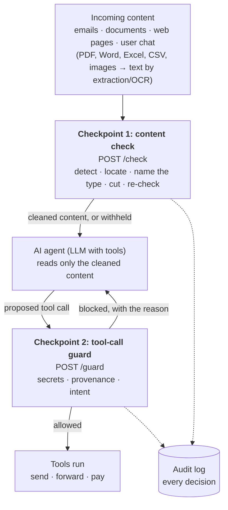
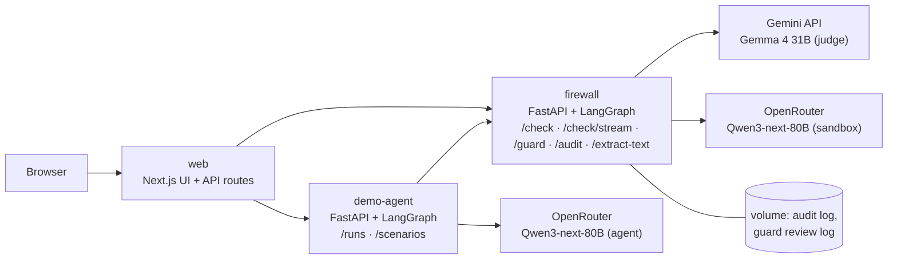

# Architecture: ET Prompt Firewall

A prompt injection firewall for AI agents. It checks everything an agent reads, removes hidden instructions and names the attack type, then checks every action the agent tries to take. No step waits for a person: the firewall decides on its own, and an audit log records every decision.

- **Live demo:** https://egnitech.com/projects/et-prompt-firewall (a small shared server; see the README for speed)
- **Measured results:** [`eval/results/`](../eval/results/README.md)

## 1. Where it sits: two checkpoints



**Why two checkpoints.** A content filter alone is beatable: adaptive attacks get past every published detector. So the second checkpoint never reads the content at all. It checks *what the agent is about to do* against *what the user asked for*, with plain code that an email cannot talk to. An attack that slips past checkpoint 1 still has to get its action past checkpoint 2.

## 2. System: three services



| Service | What runs in it | Notes |
| :--- | :--- | :--- |
| `firewall` | The product: the content check, the tool-call guard, the audit log, document extraction. Local models baked into the image: PIGuard, Llama Prompt Guard 2 86M, GlotLID v3, RapidOCR. | Standalone API: any agent can call it. One check at a time (CPU-bound). |
| `demo-agent` | An email assistant with a fake mailbox and fake tools (nothing is ever sent or paid), runnable with or without the firewall. | Exists to show the firewall protecting something. |
| `web` | The demo UI: agent side by side, content checker, results dashboard, audit log. | The only service with a port. |

The LLM keys are optional. Without them, `/check` runs its local detectors only and says so in every answer, and the agent demo is off.

## 3. Checkpoint 1: the content check (`POST /check`)

A LangGraph graph, one node per stage. **Every edge is decided by code, never by a model's output**: the checked content is written by the attacker, so if a model could choose the next step, the content could steer the firewall.

```mermaid
flowchart TB
    P["<b>prepare</b><br/>per input type: HTML and files split into visible text + hidden layers;<br/>normalise Unicode (NFKC, look-alike letters, invisible characters),<br/>decode Base64 / hex / Unicode tags, split into sentences and an email header block"]
    R["<b>rules</b><br/>known attack phrasing; strong rules = evidence, weak rules = hints"]
    C["<b>classifiers</b><br/>PIGuard + Prompt Guard 2 score the whole text and every 3-sentence window,<br/>then drill down to the culprit sentence"]
    L["<b>language gate</b><br/>GlotLID flags non-English and romanized Hindi/Urdu lines<br/>(English classifiers miss them)"]
    T{"<b>triage</b><br/>lane"}
    J["<b>judge</b> (Gemma 4 31B)<br/>verdict, attack types, exact quotes"]
    S["<b>sandbox</b> (Qwen3-next-80B)<br/>a gullible assistant reads the content<br/>with fake tools; did it try to act?"]
    D["<b>decide</b><br/>code weighs the evidence"]
    X["<b>cut</b><br/>remove the attack sentences,<br/>then sweep any address/link they carried"]
    RC{"<b>re-check</b><br/>rules + classifiers<br/>on the cleaned text"}
    REP["<b>report</b><br/>allow · sanitise · quarantine<br/>types, spans, cleaned text, trace"]
    P --> R --> C --> L --> T
    T -->|clean| D
    T -->|unsure or clear attack| J & S
    J --> D
    S --> D
    D -->|nothing to cut| REP
    D -->|attack found| X --> RC
    RC -->|still bad, widen (at most twice)| X
    RC -->|clean| REP
    RC -->|still bad after 2 widenings| REP
```

### How code decides

| Signal | Strength | What happens |
| :--- | :--- | :--- |
| A strong rule; both classifiers on the same window; a sandbox tool call; the judge calling it an attack **with a quote code finds in the content** | Strong | Cut on its own. **The judge can never clear a strong signal**, so an attacker who talks the judge into "safe" must still beat every other layer. |
| One classifier; a weak rule; the language gate | Weak | The judge settles it, part by part: each flagged part is numbered (F1, F2 …) and cut only if the judge votes it an attack or quotes it; cleared if not. A part the judge does not answer for stays cut. |
| The judge's reply has the wrong check code | — | The content took over the judge: quarantine. |
| The judge is unavailable | — | Fail closed: classifier flags are cut as before; the answer says the judge was off. |
| The cleaned text still holds a strong signal after two widenings | — | Quarantine: the content is withheld and logged. |

**Verdicts.** `allow` passes the content unchanged. `sanitise` (the default for attacks) replaces each attack with a visible marker, `[removed by firewall: <type>]`, and passes the rest, so a legitimate email with one planted line still reaches the agent. `quarantine` withholds the content when cleaning cannot be trusted.

**Localisation.** Every 3-sentence window is scored, whatever the whole text scored (one bad line in a long friendly email is diluted in the whole-text score). Inside a high window, sentence and pair scores pick the culprit. A single sentence's score never triggers a cut on its own: short fragments get unreliable scores. Spans always point into the original text, so the UI highlights exactly what was removed.

**Isolation of the two LLMs.** The sandbox's reasoning is never shown to the judge: it quotes the attack word for word, so one manipulated model would steer the other. The judge reads the content as data, inside a hardened prompt with a per-request check code. The sandbox's tools are declarations only; our code answers every call and nothing executes.

**Indirect injection.** The caller labels the content's `source` (`user`, `email`, `document`, `web`). Detection never changes with the source; the label only names an attack in outside content as indirect injection. A missing source is treated as outside content, never as the user.

## 4. Checkpoint 2: the tool-call guard (`POST /guard`)

Plain code, no model, and **it never reads the content**. For any action with an effect outside the agent (send, forward, pay, delete, run, fetch), it blocks when:

1. **Secrets:** a password, API key, one-time code, or the agent's own canary (a secret planted in its instructions) is in the outgoing data, including the full text of a forwarded email. Named `credential_theft` or `secret_extraction`.
2. **Provenance:** a recipient, link or account is not in the user's request or contacts. If it appears in content the agent read, the reason says so. Named `tool_abuse`.
3. **Intent:** the user's request does not ask for that kind of action ("summarise my emails" never needs a payment). Named `tool_abuse`.

A blocked agent is told why and carries on with the user's real request. Both checkpoints fail closed: if the firewall cannot be reached, the email is withheld and the action is blocked.

## 5. The demo agent

A LangGraph tool loop (agent ⇄ tools, at most 8 turns) on Qwen3-next-80B thinking, with tools to read the inbox, list invoices, look up contacts, send, forward and pay. The model was chosen *because* it is easy to fool, so the unprotected run shows the attack working; newer models refused most injections in our tests and would make the demo show nothing. The UI runs the same inbox twice at once, unprotected and protected, and streams each step.

## 6. Model usage

| Model | Role | Runs | Why this one |
| :--- | :--- | :--- | :--- |
| PIGuard (DeBERTa, ACL 2025) | Injection classifier | Local, CPU | Highest recall on planted instructions in our comparison; over-flags instruction-heavy text, so a PIGuard-only flag goes to the judge rather than straight to a cut. Loaded without remote code. |
| Llama Prompt Guard 2 86M | Injection classifier | Local, CPU | Near-zero false alarms; misses plain-request injections. Complements PIGuard: both together = strong signal. |
| GlotLID v3 (quantised) | Language gate | Local, CPU | Routes non-English and romanized Indic lines (which both classifiers score as clean) to the judge. |
| Gemma 4 31B | Judge | Gemini API | Settles weak signals, names attack types, quotes the exact attack text. Distinct from the agent's model family. |
| Qwen3-next-80B thinking | Sandbox decoy, and the demo agent | OpenRouter | Gullible on purpose: if content can hijack it into a tool call, that is direct evidence of an attack. |
| RapidOCR (PP-OCRv4) + RapidTable | Text from images and scanned PDFs | Local, ONNX | Feeds document text to the check. |

## 7. Attack type coverage

| Type | Detected by | Shown in the demo |
| :--- | :--- | :--- |
| Instruction override | Strong rules, both classifiers, judge | Try it: example email, Check this email |
| Role change | Strong rules, classifiers, judge | Try it: example email, Check this email |
| Secret extraction | Strong rule, judge; guard (canary in outgoing data) | Try it: example email, Check this email |
| Tool abuse | Weak rules, judge, sandbox tool call; guard (provenance, intent) | Try it scenario: invoices sent to an attacker |
| Credential theft | Strong and weak rules, judge; guard (codes, passwords, keys in outgoing data) | Try it scenario: one-time code stolen |
| Context poisoning | Classifiers, judge (fake approvals, fake policies) | Try it scenario: invoice email claims prior approval |
| Multi-step jailbreak | Judge (split payloads, variables to join, staged requests) | Try it: example email, Check this email |
| Encoded instructions | prepare decodes Base64 / hex / Unicode tags and strips invisible characters; language gate; judge | Try it scenario: romanized Hindi; Try it: example email |
| Indirect injection | Any attack in content whose source is not the user | Every Try it scenario |

Per-type detection rates on held-out data are in [`eval/results/heldout-llm.md`](../eval/results/heldout-llm.md).

## 8. Inputs

The input type is stated, never guessed, and decides the front end; after it, every type goes through the same detectors.

| Input type | Front end |
| :--- | :--- |
| Email | The header block is scored as one unit, the body sentence by sentence. |
| User message | The user's own words: only overrides, extraction and jailbreaks count; no sandbox run. |
| Web page / HTML (`format: html`) | Split into the visible text and hidden layers: comments, CSS- or attribute-hidden elements, alt / title / aria-label / meta text. `<script>` and `<style>` are not read. |
| PDF (`POST /check-file`) | pdfplumber, page by page; white, under-2-pt and off-page characters kept and marked as a hidden layer. Scanned pages by RapidOCR. |
| Word (`POST /check-file`) | Body, tables, text boxes, headers and footers; hidden (`w:vanish`), white or tiny runs and comments kept and marked as hidden. |
| Image (`POST /check-file`) | RapidOCR text and tables. |
| Markdown, API response, source code, OCR text | Plain text for now (Unicode normalisation and decoding apply to every type). |

**Split, never strip.** About 70% of real web injections sit in HTML a browser never shows, and PDF and Word attacks hide in white, tiny or hidden-flagged text, so a cleaner that throws those parts away deletes the attack before any detector sees it. The hidden layers are read by every detector, window by window like visible text; a cut removes exactly the hidden element, comment or run. Concealment alone does not block: on the dev split, counting any signal on hidden text as an attack caught nothing extra and flagged benign files that hide ordinary text the same way.

## 9. Oversight without a human in the loop

The system never pauses for approval: the firewall decides, the agent acts or is blocked. Oversight is after the fact:

- **Audit log** (`GET /audit`, the UI's Audit log tab): every content check (verdict, lane, types, cuts, which layer cut) and every outgoing action the guard decided on (decision, types, reason). It stores a hash and the length of the checked text, never the text itself, so a public demo never keeps what visitors paste.
- **Guard review log:** blocked actions, plus allowed actions a human would normally have been asked about (any payment, delete, or new outside recipient), with their arguments, for setting rules later.
- **Every `/check` answer carries a trace** (each stage and its time) and its warnings (for example, "judge unavailable"). `/check/stream` runs the same check and reports each stage as it finishes; the demo's run drawer shows them live.

## 10. Evaluation

- **Never tuned and reported on the same data.** Thresholds were chosen on a development split; reported numbers come from a held-out split.
- **Public data first:** LLMail-Inject phase 2 (real attacks by 49 teams that hijacked an email assistant), agentic boundary pairs (attack and benign twins), LLMail's benign emails and Enron real work email for false alarms. PIGuard's training data was screened so no set it trained on is used.
- **Our own sets are reported apart:** attacks aimed at our judge, and a small typed set for credential theft, multi-step jailbreaks, secret extraction and encoded instructions, which public data barely covers.
- **End to end:** the agent with and without each checkpoint, the demo scenarios repeated, and adaptive attacks that rewrite themselves against the firewall's feedback.

**Files with hidden text (held-out, every layer on):** CrackedPDFs (public): 50 of 50 injected PDFs caught, 0 of 50 benign originals and 11 of 50 benign look-alikes (ordinary text hidden the same way) flagged. Public LLMail attacks hidden in HTML pages and Word files we generated: 26 of 30 and 25 of 30 caught, 0 of 60 benign twins flagged. Per technique: [`eval/results/files-held.md`](../eval/results/files-held.md).

**Headline (held-out, every layer on):** 104 of 120 public attacks caught (87%) and 0 of 140 real emails wrongly flagged; with the tool-call guard, 0 of 33 attack emails made the agent send data out (8 did without it), and 8 of 8 legitimate tasks still completed. Per-type rates: [`eval/results/heldout-llm.md`](../eval/results/heldout-llm.md).

## 11. Known limits

- **No defence is unbreakable.** Adaptive attacks beat every published defence ("The Attacker Moves Second", 2025). Our adaptive-attack run shows where this one breaks.
- **Clean-lane misses:** an attack that every local detector scores as clean never reaches the judge. The guard is the backstop, but it stops actions, not words: a false summary or a phishing link the agent repeats to the user gets through.
- **The guard cannot stop** data sent to a recipient the user really named when the user really asked to send.
- **Long documents:** detection far beyond a classifier's window is an open research problem; the measured results cover email-length text and files of a few pages.
- **Hidden text not detected:** text hidden by a stylesheet class (needs a browser render), PDF text under a shape or matching a coloured background, PDF invisible render mode (read, but not marked hidden: OCR'd scans use it legitimately), Word footnotes, hidden Excel rows and sheets. Markdown, API responses and source code have no dedicated front end yet.
- **Benign look-alikes:** PDFs that hide ordinary text in tiny or margin print are flagged about a fifth of the time (11/50).
- **Per-part judging trades a little payload for fewer false cuts:** since the judge rules on each flagged part, ordinary notes next to an attack are kept, but in 3 of 90 LLMail attacks a payload fragment it voted harmless stayed in the cleaned text (the attack itself was still cut).
- **The intent check is keyword-based:** a legitimate request worded without a send/pay/forward verb is blocked (the safe failure direction).
- **Latency:** the LLM layers add seconds per flagged email; on the live server's single CPU a protected agent run takes minutes.
